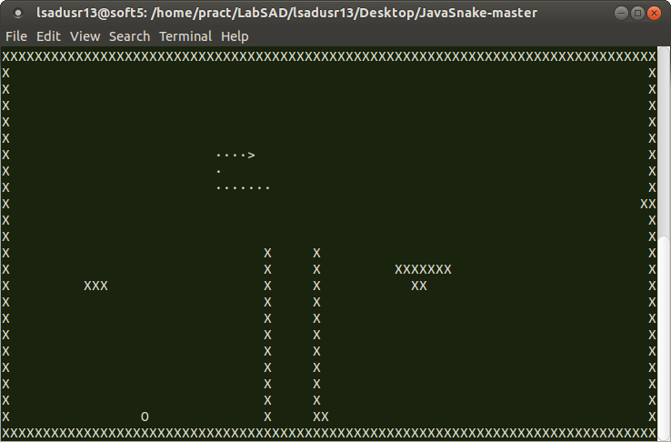

# JavaSnake

> A classic Snake game in your terminal, written in Java.



*Each game board is unique!*


## Overview

JavaSnake is a console-based implementation of the classic Snake game. Each time you play, you’ll navigate your snake through a randomly generated maze of walls, gobbling food to grow ever longer—without crashing into walls or yourself!

Key features:

- **Random map generation**  
  Walls are placed at random, but the board is guaranteed to be fully traversable so you’ll never get stuck.

- **Dynamic sizing**  
  Automatically adapts to your terminal’s current dimensions.

- **High-score tracking**  
  Keep playing until you beat your longest run.

## Prerequisites

- Java 8 or later
- A UNIX-compatible terminal

## Running

Launch the game with:

```bash
./play.sh
```

## Controls

* **Arrow keys**: Change your snake’s direction.
* **Q** or **Ctrl+C**: Quit the game at any time.

Press any key to start a new game; your high score will be displayed between rounds.

## How It Works

1. **Map Generation**

   * Borders are walled off automatically.
   * A number of internal wall segments are added at random positions and orientations.
   * Before committing a wall, the code checks (via a flood-fill) that the remaining “void” cells form a single connected component.

2. **Snake Initialization**

   * The snake spawns at a random void location of length 2, facing “up” by default.

3. **Game Loop**

   * Moves are triggered on a short timer (100 ms), restarting whenever you press an arrow key.
   * Eating food grows the snake by one segment; running into walls or yourself ends the game.


## License

This project is licensed under the [MIT License](https://opensource.org/licenses/MIT).
See **LICENSE** for full terms.
